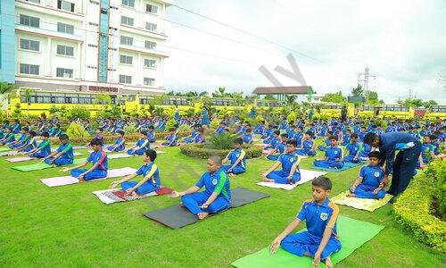
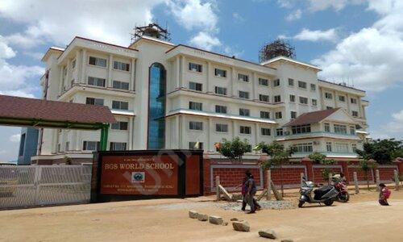
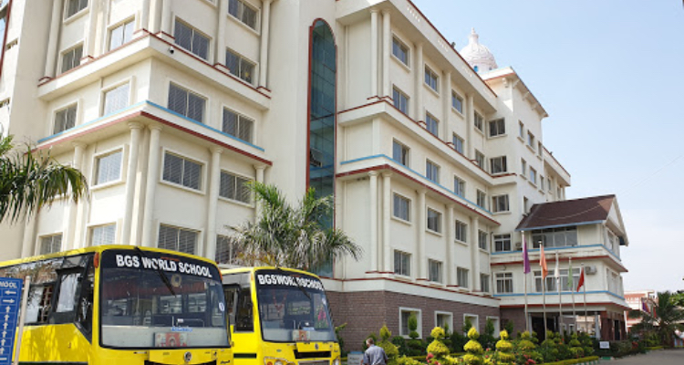
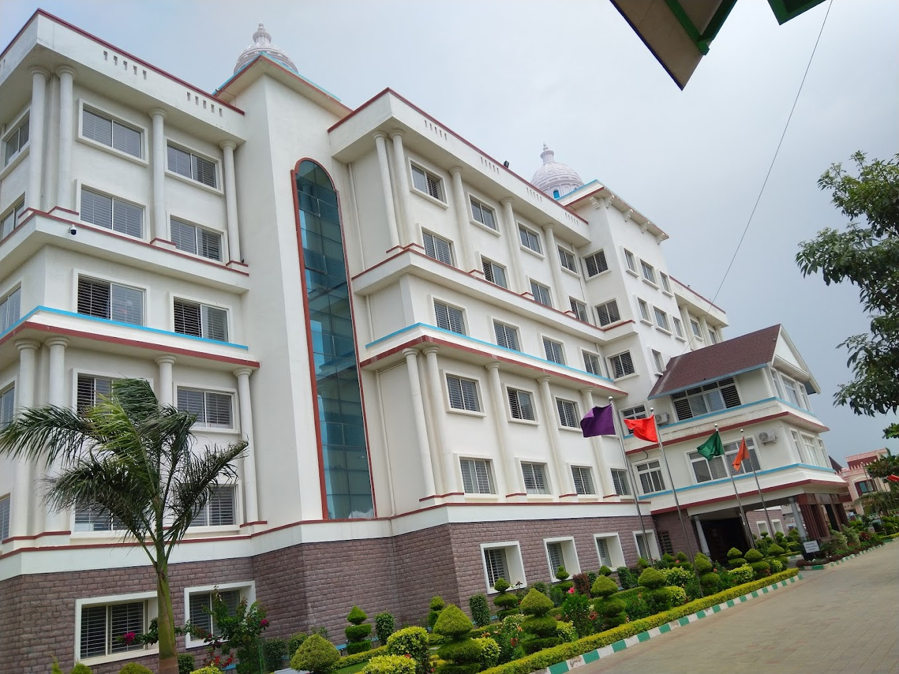

<!DOCTYPE html>
<html lang="en">
<head>
    <meta charset="UTF-8">
    <title>BGS World School Nagarur | Admissions 2026-2027</title>

    <meta name="viewport" content="width=device-width, initial-scale=1.0">
    <meta name="description" content="BGS World School Nagarur Admissions Open 2026-2027. Quality education, smart classrooms, and holistic development.">

    
</head>

<body>

<header class="header-container">
    

        
    

    

        <h1>BGS WORLD SCHOOL</h1>
        <h2>Nagarur</h2>
        <h2>Admissions Open for Academic Year 2026 – 2027</h2>
        
Shaping Young Minds • Building Bright Futures

    

    

        
    

</header>

<section>
    <h3>Welcome to BGS World School, Nagarur</h3>
    

        BGS World School, Nagarur is committed to delivering quality education in a safe,
        disciplined, and inspiring environment that nurtures academic excellence and character.
    

</section>

<section>
    <h3>Why Choose BGS World School?</h3>
    

        <ul>
            <li>Experienced and dedicated faculty</li>
            <li>Smart classrooms and modern teaching methods</li>
            <li>Focus on academic excellence and discipline</li>
            <li>Safe and secure campus</li>
            <li>Holistic development of every child</li>
        </ul>
    

</section>

<section>
    <h3>Our Vision</h3>
    

        To nurture confident, responsible, and future-ready students with strong moral values.
    

</section>

<section>
    <h3>Our Mission</h3>
    

        To provide balanced education integrating academics, sports, creativity, and life skills.
    

</section>

<section>
    <h3>Our Campus</h3>
    

        
        
        
        
        
    

</section>

<section>
    <h3>Admissions Open 2026 – 2027</h3>
    

        Visit our campus to experience a nurturing learning environment.
    

</section>

<section>
    <h3>Contact Us</h3>
    

        📍 BGS World School, Nagarur 
        📞 9449912993
    

</section>

<footer>
    

        BGS World School, Nagarur 
        Building Bright Futures
    

</footer>

</body>
</html>
# student-website
